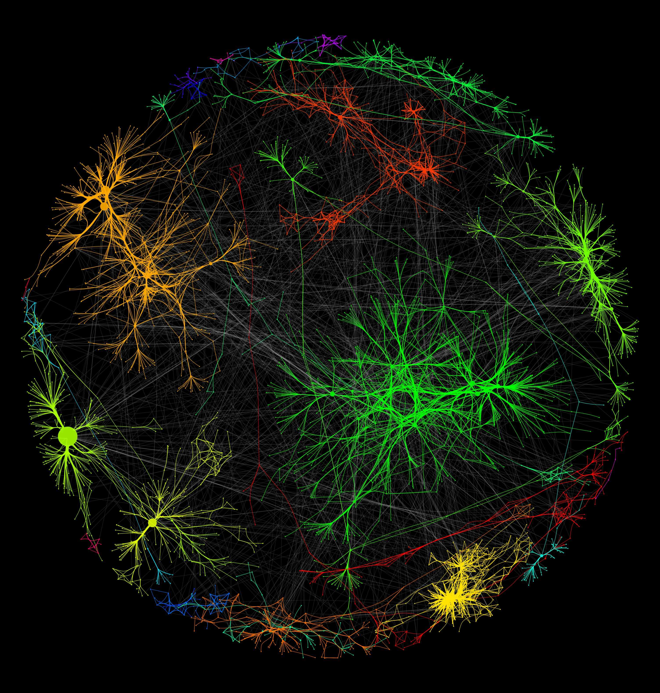

# MetaFoR

Metadata for R packages: This is our final project submission for GR5702: Exploratory Data Analysis and Visualization course at Columbia University.

**NOTE**: We will keep updating this Readme as we progress through the project!

---

## Introduction

---

## Methodology

---

## Outcome

---

## Authors

- Bhargav Kantheti (bk2899)
- Ryuichiro Sonoda (rs4493)

---

## Credits

We are using data from two R packages:

- **available** [CRAN](https://cran.r-project.org/web/packages/available/index.html): This package let us "Check if the Title of a Package is Available, Appropriate and Interesting".
- **pkgsearch** [CRAN](https://cran.r-project.org/web/packages/pkgsearch/index.html): This package helped us "Search CRAN metadata about packages by keyword, popularity, recent activity, package name and more. Uses the 'R-hub' search server, see <https://r-pkg.org> and the CRAN metadata database, that contains information about CRAN packages."
